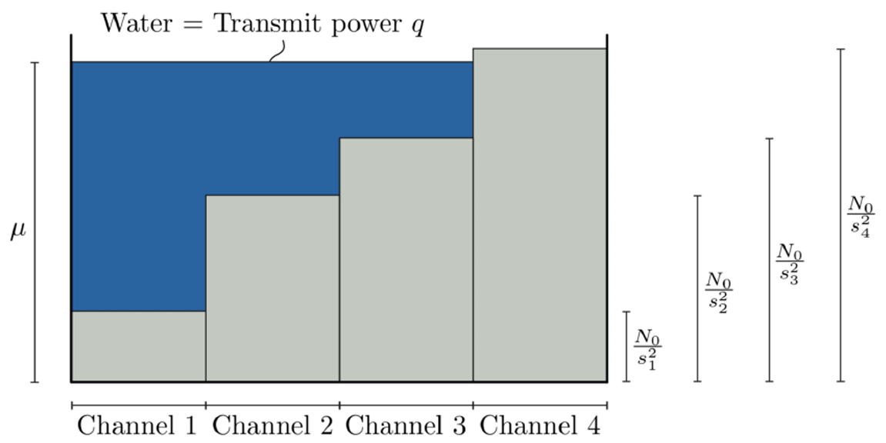
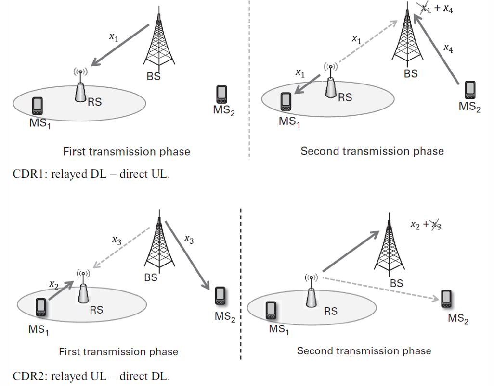
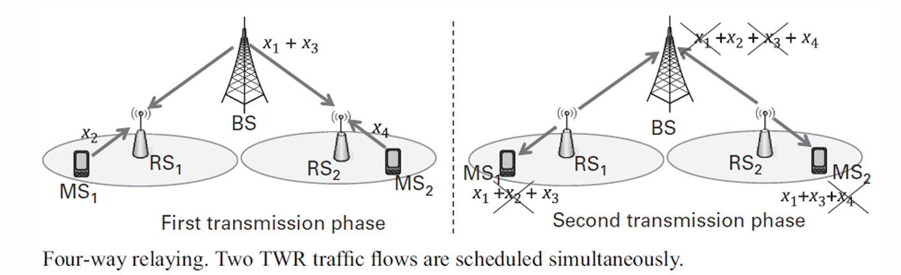
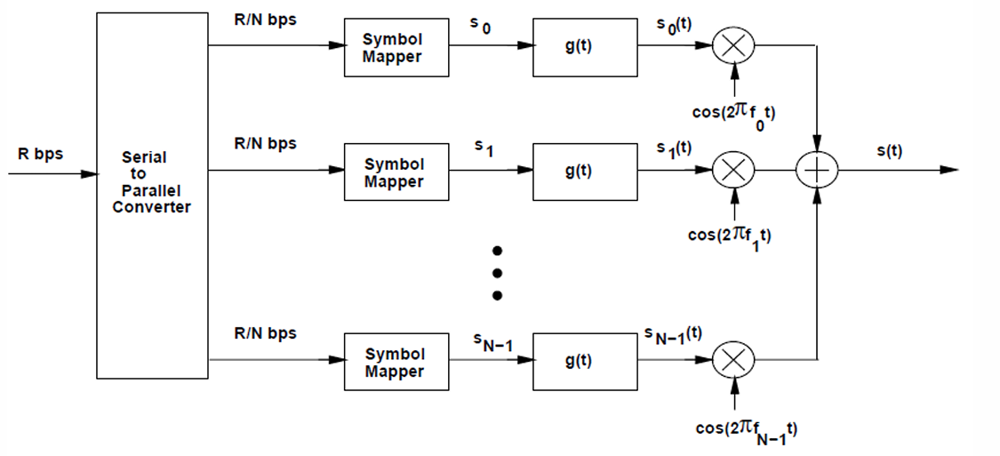
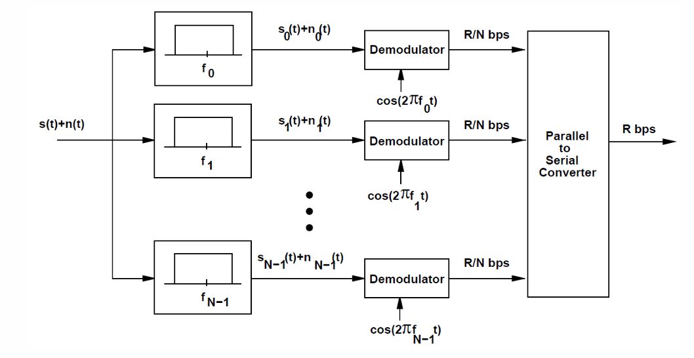
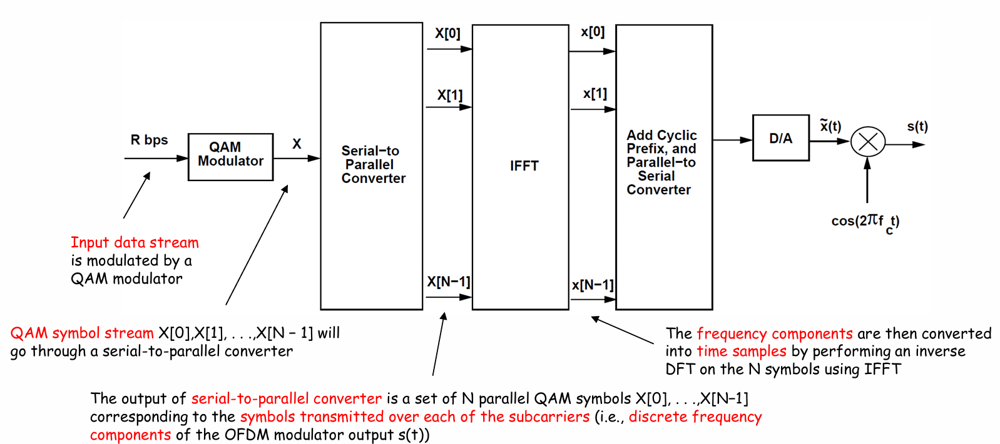
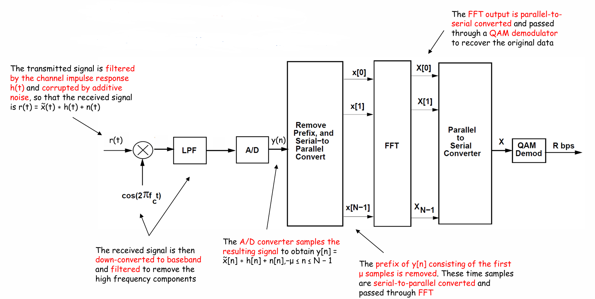

# 现代无线通信
## 1. 天线与传播
### 1.1 天线基础
天线 (Antenna)：将电信号转换为电磁波（发射）或反之（接受）的过渡器件 (An antenna is a device that converts electrical signals into radio waves (for transmission) and vice versa (for reception).)

传输线 (Transmission line)：连接射频源与天线的专用电缆或波导 (A specialized cable or waveguide that connects the radio transmitter or receiver to the antenna)
- 同轴电缆
- 平行线
- 波导
### 1.2 天线参数
天线辐射图：
- 主瓣 (Major lobe)：辐射最强的方向
- 旁瓣 (Side lobe)：非主方向的辐射
- 波束宽度 (Beamwidth)：HPBW & FNBW

场区划分：
- 反应近场区 (Reactive near-field)：紧邻天线，电磁场以储能为主，适用于NFC、RFID等 (Area closest to the antenna, where the electromagnetic fields are highly reactive and non-radiating)

$$R < 0.63\sqrt{\frac{D^3}{\lambda}}$$

- 辐射近场区 (Rediating near-field)：又称菲涅尔 (Fresnel) 区，辐射开始形成 (The region 
between the reactive near-field region and the far-field region; The Radiation starts to form in this region)

$$0.63\sqrt{\frac{D^3}{\lambda}} < R < \frac{2D^2}{\lambda}$$

- 远场区 (Far-field)：又称夫琅禾费 (Fraunhofer) 区，辐射完全形成，用于大多数通信系统 (The area furthest from the antenna where electromagnetic fields are radiated)

$$\frac{2D^2}{\lambda} < R$$

方向性 (Directivity, $D$)：远场参数，描述天线收束能量的能力 (A far field parameter which describes the ability of antenna to focus energy to (a particular) direction(s))
- 各向同性天线 (Isotropic antenna)：理想均匀辐射模型（球形，基本模型）(Antenna which radiates equal amount of energy in all directions)
- 全向天线 (Omnidirectional antenna)：水平面均匀辐射（面包圈型）(Radiates energy equally in all direction of horizontal plane but very limited radiation in vertical plane)
- 定向天线：将能量聚集到特定方向，方向性越大，波束越窄

增益 (Gain, $G$)：考虑天线效益后，相对于各向同性天线的定向辐射能力 (A measure of how well an antenna can focus energy to a particular direction compared to an isotropic antenna)

$$G=e_{\text{tot}}\cdot D$$

$e_{\text{tot}}$ 为总效率
- 单位：dBi（相对于各向同性天线）、dBd（相对于偶极子）
- 同一天线，波束越窄，增益越大

阻抗 (Impedance, $Z$)：天线输入端的电流与电压之比 (The relationship between the voltage and current at the feed point of the antenna)

$$Z=R+jX$$

$R$：电阻部分，消耗或辐射能量; $X$：电抗部分，储存能量
- 阻抗匹配 (Impedance matched)：天线阻抗应与传输线阻抗匹配（通常为 $50\Omega$），以实现最大功率传输

反射系数 (Reflection coefficient, $\Gamma$)：反映阻抗失配产生的能量反射 (The ratio of reflected voltage to incident voltage, measuring the reflection or energy loss)

$$\Gamma=\frac{Z_L-Z_0}{Z_L+Z_0}$$

回波损耗 (Return loss)：反射系数的对数形式（通常要求其大于10dB）($\Gamma$ experssed in dB)

$$\text{RL}=-20\log_{10}(\left|\Gamma\right|)$$

反射的功率：
 
$$P_{r}=10^{-\frac{\text{RL}}{10}}$$

### 1.3 天线类型与设计
天线类型：鞭状/单极子、偶极子、八木、环、喇叭、反射阵列、微带贴片、反射面（碟形）、MIMO、相控阵等

半波偶极天线 (Half-wave dipole antenna)：
- 总长度: $L=\dfrac{\lambda}2$
- 馈电阻抗 (Feed-point impedance): $\approx73\Omega$（自由空间）
- 实际长度要 $\times0.97$ 补偿末端效应

微带贴片天线 (Microstrip antenna)：
- 结构：
  - 辐射贴片 (Patch)：The part of the antenna that radiates electromagnetic waves. It is usually made of a conducting material such as copper or gold and can have different shapes 
  - 介质基板 (Substrate)：The patch is placed on a dielectric material. The dielectric constant of the substrate influences the performance of the antenna
  - 接地板 (Ground plane)：A conductive ground plane is located on the opposite side of the dielectric substrate. It helps to reflect the energy radiated by the patch to improve radiation efficiency
  - 微带馈线 (Microstrip feed line)：The microstrip feed line is used to deliver energy from the signal source to the radiating patch of the antenna. Also used for impedance matching
- 设计步骤：

1. 已知：
     - 谐振频率 (Resonant Frequency): $f_r$
     - 介质介电常数 (Dielectric Constant of the Substrate): $\varepsilon_r$
     - 基板高度 (Height of the Substrate): $h$
2. 贴片宽度 $W$：
   
$$W=\frac{c}{2f_r}\sqrt{\frac{2}{\varepsilon_r+1}}$$

3. 有效介电常数 $\varepsilon_{reff}$：

$$\varepsilon_{reff}=\frac{\varepsilon_r+1}2+\frac{\varepsilon_r-1}2\sqrt{1+12\frac{h}{W}}$$

4. 长度延伸量 $\Delta L$：

$$\Delta L=0.412h\frac{\left(\varepsilon_{reff}+0.3\right)\left(\dfrac{W}{h}+0.264\right)}{\left(\varepsilon_{reff}-0.258\right)\left(\dfrac{W}{h}+0.8\right)}$$

5. 实际长度 $L$：

$$L=\frac{c}{2f_r\sqrt{\varepsilon_{reff}}}-2\Delta L$$
  
6. 根据 $Z_0=50\Omega$ 计算馈带宽度 $W_f$ ($t$是贴片厚度)：
   
$$W_f=\frac{7.48\times h}{e^{Z_0\frac{\sqrt{\varepsilon_r+1.41}}{87}}}-1.25\times t$$

7. 确定接地板尺寸

$$L_g=L+6h,\quad W_h=W+6h$$

- 特点：
  - 贴片形式多种多样
  - 低剖面，易制造，成本低
  - 端射 (Broadside) 辐射模式 (Microstrip antennas typically exhibit broadside radiation, meaning they radiate perpendicular to the surface of the antenna)
### 1.3 弗里斯传播方程 (Friss Transmission Equation)
描述自由空间中发射与接收功率的关系：

$$P_r=P_tG_tG_r\left(\frac{\lambda}{4\pi d}\right)^2$$

对数形式：

$$P_r(\text{dB})=P_t(\text{dB})+G_r(\text{dB})+G_t(\text{dB})-20\log_{10}\left(\frac{4\pi d}{\lambda}\right)$$

假设条件：自由空间，无阻挡
### 1.4 卫星通信天线
空间段 (Space Segment)：卫星本身及星载天线

地面段 (Ground Segment)：地面站发射/接收天线

地面段天线类型：
- 抛物面反射天线：高增益、窄波束 (Uses a curved surface with the cross-sectional shape of a parabola, to direct radio waves. It has very high directivity and gain, producing the narrowest beamwidths for point-to-point communications)
- 馈电方式：卡塞格伦 (Cassegrain)、格雷戈里 (Gregorian)、前馈 (Front feed)、偏馈 (Offset feed)等

星载天线类型：
- 反射面天线 (Reflector)、喇叭天线 (Horn)、相控阵天线 (Phased array)、反射阵列天线 (Reflectarray)、贴片天线 (Patch) 等
### 1.5 5G
第五代通信技术 (5G)：The fifth generation of wireless cellular technology and is the new global wireless standard after 4G/LTE.

关键技术：
- 增强移动宽带 (Enhance Mobile Broadband, eMBB)：Provides significantly faster data speeds and larger data volumes for mobile communications
- 大规模机器通信 (Massive Machine Type Communication, mMTC)：Supports the connectivity of a vast number of devices, particularly in massive IoT applications
- 超可靠低时延通信 (Ultra-Reliable and Low Latency Communication, URLLC)：Designed for applications that require extremely low latency and high reliability, such as autonomous vehicle, remote real-time surgeries, etc

频谱：
- 低频段 (<1 GHz)：覆盖广
- 中频段 (1~6 GHz)：平衡覆盖与容量
- 高频段 (>24 GHz)：高速短距

先进天线系统 (Advanced Antenna System, AAS)：使用多天线技术包括波束成形和MIMO技术 (An active antenna system, where the active transceiver array and the passive antenna array are intelligently integrated into a single hardware unit)

### 1.6 MIMO
天线配置类型：
- 单输入单输出，SISO
- 单输入多输出，SIMO
- 多输入单输出，MISO
- 多输入多输出，MIMO

MIMO使用多天线同时传输数据流，在不需要额外带宽或更高功率的前提下提高吞吐量

MIMO信道模型：
- 接受信号向量（数学模型）: $\boldsymbol{Y}=\boldsymbol{HX}+\boldsymbol{W}$ ($\boldsymbol{X}\to\boldsymbol{Y}$)
- $\boldsymbol{H}$为信道矩阵, $\boldsymbol{W}$为噪声矩阵

空间分集 (Spatial diversity)：
- 通过多个独立信道发送相同数据，提高可靠性 (Provides diversity gain; Multiple copies of the same data are sent across independently fading channels)
- 分集增益 $=$ 发射天线数 $\times$ 接收天线数 (Diversity gain)
- 理论上最大分集增益与分集路径相等
- $1\to N$中每个N收到的都一样

空间复用 (Spatial multiplexing)：
- 通过多个信道发送独立数据流，提高数据率（复用增益, Multiplexing gain） (Provides multiplexing gain. Each channel carries independent information.)
- $1\to N$中每个N收到的都不一样

大规模MIMO (Massive MIMO)：基站部署大量天线（数十至数百），提升频谱和能量效率 (A type of wireless communications technology in which base stations are equipped with a very large number of antenna elements, utilizing the same time and frequency resource, to improve spectral and energy efficiency)
- 应用技术：
  - 波束成形 (Beamforming)：通过调整天线阵列相位，将波束指向特定用户，增强信号并减少干扰 (Involves the directional transmission and reception of signals between a base station and user equipment; It uses multiple antennas to create narrow beams that can be directed toward specific users or devices, rather than broadcasting signals in all directions)
    - 更高的数据传输速率 (Higher data rates)
    - 更好的覆盖 (Better coverage)
    - 更有效的利用可用频谱 (More efficient use of the available spectrum)
    - 帮助用户在不干扰其他用户的情况下接收强信号 (Helps a user to receive a strong signal without interference with other users)
    - 方法：通过预先补偿发射天线的相位 (By pre-compensating the phases of transmit antennas)
  - 多址技术 (Multiple access technique)：Enables multiple users to simultaneously share a finite piece of radio spectrum.
    - 老版本通信：
      - 码分多址 (Code division multiple access)
      - 频分多址 (Frequency division multiple access (FDMA))
      - 时分多址 (Time division multiple access)
    - 5G 使用的新技术：
      - 正交频分多址 (Orthogonal FDMA (OFDMA))
      - 单载波频分多址 (Single-carrier FDMA (SC-FDMA))
      - 非正交多址 (Nonorthogonal multiple access)
      - 波分多址 (Beam Division Multiple Access (BDMA))：将波束分配给不同用户，实现多址接入，适用于5G高密度场景 (Works by allocating highly directive orthogonal beams to multiple mobile stations in 5G networks)
  - 波束导向 (Beam Steering)：通过电子相位控制动态改变波束方向，用于跟踪移动目标 (The process of dynamically changing the direction of the main lobe of a beam in an antenna array system)

阵列天线 (Array Antenna)：将特定模式排列的多个单独天线元件作为单个天线系统协同工作的配置 (A configuration of multiple individual antenna elements arranged in a specific pattern to work together as a single antenna system)

相控阵天线 (Phased Array Antenna)：由多个天线单元组成，通过电子控制相位实现波束扫描 (A type of array antenna in which the phase of the signal at each individual antenna element is controlled electronically)
- 阵列增益公式 ($N$为单元数, $G_e$为单元增益, $L$为损耗)：

$$\text{Array Gain}=10\log_{10}(N)+G_e-L_{\text{ohmic}}−L_{\text{scan}}$$

## 2. 大规模MIMO系统
### 2.1 大规模MIMO
优势：
- 容量提升 (Capacity enhancement)：支持更多用户和设备 (It can accommodate more users and devices in a single cell, which is crucial for dense urban environments)
- 能量更有效 (Energy efficiency)：波束赋形减少能量浪费和干扰 (Due to beamforming, energy can be concentrated where it’s needed, reducing power wastage and interference)
- 数据速率提升 (Enhanced data rates)：同时服务多用户 (With the ability to serve multiple users simultaneously using same resources, it boosts overall network throughput)
- 链路可靠性 (Link reliability)：多径效应提升信号可靠性 (Large number of possible paths are created in massive MIMO between transmitter and receiver, improving the reliability)

特性：
- 通过波束赋形 (Beamforming) 和波束导向 (Beam steering) 实现5G承诺的高吞吐量与容量
- 波束更窄，天线远多于用户设备，提升传输精准度
- 使用毫米波频段（>24 GHz），天线小巧易安装

特征：天线数M远大于用户数K
### 2.2 频谱效率
区域吞吐量 (Area Throughput)：
- 区域吞吐量 $=$ 带宽 $\times$ 小区密度 $\times$ 频谱效率
- 单位: $\text{bps}/\text{km}^2$
- 提升吞吐量：
  - 增加带宽 (Allocate more bandwidth)
  - 增加基站密度 (Densify the network by adding more BSs)
  - 提升每小区频谱效率 (Improve the SE per cell)

双重网络结构 (Two Network Tier)：
- 热点层 (Hotspot tier)：高吞吐量、小范围服务少数用户，适用于毫米波频段
- 覆盖层 (Coverage tier)：广域覆盖、支持移动性，频谱效率是关键挑战
  - 覆盖层是重点研究方向

频谱效率 (Spectral Efficiency)：每复样本可可靠传输的比特数，单位 $\text{bps}/\text{Hz}$
- 带宽 (Bandwidth)：
  - 基带信号 (Baseband): $B/2$
  - 通带信号 (Passband): $B$
- 奈奎斯特-香农采样定理：带宽为 $B$ 的信号每秒至少需 $2B$ 个实样本

提升频谱效率的途径（大规模MIMO）：
  - 多用户同时传输 (Many simultaneous users)
  - 强定向信号 (Strong directive signals)
  - 低干扰 (Little interference leakage)

不同模型的区别: $q$为样本能量, $q=P/B$
  
||SISO|SIMO|MISO|
|:---:|:---:|:---:|:---:|
|数学模型|$y[l] = g\cdot x[l]+n[l]$|$\boldsymbol{y} = \boldsymbol{g}x+\boldsymbol{n}$|$y=\boldsymbol{g}^T\boldsymbol{x}+n$|
|输入|$x[l]\sim CN(0,q)$|$x[l]\sim CN(0,q)$|$\boldsymbol{x}=\boldsymbol{w}\tilde{x}$, $\tilde{x}\sim CN(0,q)$|
|噪声|$n[l]\sim CN(0,N_0)$|$n_m\sim CN(0,N_0)$|$n\sim CN(0,N_0)$|
|容量公式|$C=\log_2\left(1+\dfrac{q\lvert g\rvert^2}{N_0}\right)$|$C=\log_2\left(1+\dfrac{q\lVert g\rVert^2}{N_0}\right)$|$C=\log_2\left(1+\dfrac{q\lVert g\rVert^2}{N_0}\right)$|

注: $\boldsymbol{g}$为列向量, $\displaystyle\lVert g\rVert^2=\sum_{i=0}^{M}|g_m|^2$

点对点MIMO (Point-to-point MIMO)：

- 假设: $K$ 个发送端, $M$ 个接收端

$$\boldsymbol{y}=\boldsymbol{G}\boldsymbol{x}+\boldsymbol{n}$$

($\boldsymbol{G}$ 为 $M\times K$ 矩阵)

- 通过SVD（奇异值分解），有 

$$\boldsymbol{G}=\boldsymbol{U}\boldsymbol{\Sigma}\boldsymbol{V}^H$$

- 对角矩阵 $\boldsymbol{\Sigma}$ 的对角线值为 $s_1,s_2,\cdots,s_{\min{(M,K)}}$，为 $\boldsymbol{GG}^H$ 和 $\boldsymbol{G}^H\boldsymbol{G}$的非零特征值

- 令 $\tilde{\boldsymbol{y}}=\boldsymbol{U}^H\boldsymbol{y}$, $\boldsymbol{x}=\boldsymbol{V}^H\tilde{\boldsymbol{x}}$, $\tilde{\boldsymbol{n}}=\boldsymbol{U}^H\boldsymbol{n}$，有：

$$\tilde{\boldsymbol{y}}=\boldsymbol{\Sigma}\tilde{\boldsymbol{x}}+\tilde{\boldsymbol{n}}$$

- 容量 $C$：当 $q_1,q_2,\cdots,q_S$ 均最大，且 $\displaystyle\sum_{k=1}^{S}q_k=q$ ($S$为有用信道的数量，即能传输信号的信道的数量)

$$C=\sum_{k=1}^{S}\log_2\left(1+s_k^2\frac{q_k}{N_0}\right)$$

- 可通过注水算法分配功率: $q_k=\max{\left(\mu-\dfrac{N_0}{s_k^2},0\right)}$

最优功率分配——注水算法 (Waterfilling)：
  - 功率分配给信道条件好的子信道
  - 低信噪比：只分配给最强子信道 $q_1=q, \quad q_2=\cdots=q_s=0$

$$ C \approx \log_2(e)\frac{q}{N_0}s_1^2$$
  - 高信噪比：近似均等分配 $q_1=q_2=\cdots=q_s=q/s$

$$C \approx \log_2(\dfrac{q}{N_0})+\displaystyle\sum_{k=1}^S\log_2\left(\dfrac{s_k^2}{S}\right)$$

  - 复用增益在高信噪比下显著（是矩阵 $\boldsymbol{GG}^H$的秩），低信噪比下主要为波束赋形增益

点对点MIMO存在的问题：
- 传播方式：
  - 视距传播 (Line-of-sight)：在发射天线和接收天线之间，存在一条清晰、无遮挡的直接物理路径
    - 复用增益 $S\approx 1$
    - 波束赋形增益在高信噪比下可看作视距传播
  - 非视距传播 (None-line-of-sight)：发射天线和接收天线之间的直接路径被障碍物遮挡。信号只能通过反射、衍射、散射等间接路径到达
    - 复用增益 $S=\min{(M,K)}$
    - 波束赋形增益在低信噪比下可看作非视距传播
- 点对点MIMO适合应用于非视距传播
- 用户设备太小，无法安装过多天线
### 2.3 多用户MIMO (Multi-user MIMO)
将过程分为单对多MIMO的上传 (Uplink) 过程和多对单MIMO的下载 (Downlink) 过程
  
正交多址 (Orthogonal Multiple Access)
- 两个用户，一个分到 $\alpha B$ 的带宽，信道增益均为 $\sqrt{\beta}$, 则有

$$R_1=\alpha B\log_2\left(1+\frac{P\beta}{\alpha B N_0}\right)$$
$$R_2=(1-\alpha) B\log_2\left(1+\frac{P\beta}{(1-\alpha) B N_0}\right)$$

多用户上行信道建模：

$$ \boldsymbol{y}=\sqrt{\rho_{ul}}\boldsymbol{Gx}+\boldsymbol{w} $$

- $\rho_{ul}$ 为功率归一化因子，即为SNR
- $x_k$ 满足 $E[\lvert x\rvert^2]\leq 1$，即 $x$ 的频率归一化
- $\boldsymbol{w} \sim CN(0,I_M)$, $I_M$ 为 $M$ 阶单位矩阵，即 $\boldsymbol{n}$ 的频率归一化

与点对点MIMO的区别：
- 用户间无协作：用户独立编码和发送数据 (User do not cooperate)
- 性能指标不同：每个用户只考虑自己的信道表现 (Each user cares about its own performance)
- 功率约束不同：每个用户有自己的功率限制 (Each user has its own power budget)
- 信道建模差异：信道矩阵 $\boldsymbol{G}$ 建立模型不同 (The channel matrix $\boldsymbol{G}$ is modeled differently)

与大规模MIMO的区别 ($M$ 为基站天线数量, $K$ 为用户天线数量)：
- 多用户MIMO：
  - $M > K$，相差数量不大
  - 常用于LTE和WIFI
  - 很少达到容量增益 $K$
- 大规模MIMO
  - $M \gg K$，相差数量很大
  - 有更多的强指向性信号 (More directive signals)
    - 更少的随机性 (Less randomness)
    - 更大的波束赋形增益 (Larger beamforming gain)
    - 更少的干扰 (Less interference)
### 2.4 大规模MIMO
动机：由于大数定理，当天线数远远大于用户数时，可以用匹配滤波直接进行滤出需要的信号

信道处理：
- 相干时间 (Coherence time)
  - 由于用户移动，信道是时变的，但是在一段较短的时间 $T_c$ 内，信道可看作线性时不变的

$$ T_c = \frac{\lambda}{2v} \quad \text{or} \quad T_c = \frac{\lambda}{4v} $$

$v$ 为用户速度
- 相干带宽 (Coherence bandwidth)
  - 由于多径传播，信道响应是随频率变化而变化的（频率选择的），但是在一段较窄的带宽 $B_c$ 内，信道响应可以看作平坦的（常数）

$$ B_c = \frac{c}{\lvert d_{\max}-d_{\min}\rvert} \quad \text{or} \quad B_c = \frac{c}{2\lvert d_{\max}-d_{\min}\rvert} $$

- 相干块 (Coherence block)：A coherence block consists of a number of subcarriers and time samples over which the channel response is approximately constant and flat-fading
  - 将时间和频率资源网格化，每个相干块在时间上跨度 $T_c$ ，在频率上跨度 $B_c$
  - 每个相干块包含 $\tau_c=B_c\times T_c$ 个复符号（或称采样点）
  - 在一个相干块内，信道可以被一个**常数复增益**来描述

信道估计：
- 上行信道估计
  - 原理：用户发送已知的导频信号 (UE sends a single pilot signal $s \in C$ that is known in BS)
  - 核心优势：对于拥有 $M$ 根天线的基站，要估计一个用户的 $M$ 维信道向量 $h$，只需要该用户发送1个导频符号。因为基站有 $M$ 个观测方程（每根天线一个）来解1个未知向量
  - 公式: $\boldsymbol{y}=\boldsymbol{h}s+\boldsymbol{n}$
  - 推广: $K$ 个用户，需要正交的 $K$ 个导频符号 ($K$ 维正交导频序列)
- 下行信道估计
  - 原理：基站从每根天线依次发送导频，用户分别估计每根天线到自己的信道 (The BS send a known pilot signal $s$ subsequently from each antenna)
  - 核心劣势：用户要估计基站 $M$ 根天线到自己的信道，需要基站发送 $M$ 个导频符号
  - 额外开销：用户还需要通过上行链路将估计出的 $M$ 维信道 $\hat{\boldsymbol{h}}$ 反馈给基站，这又需要开销
- 时分双工与频分双工
  - 时分双工 (TDD)：利用信道互易性（上下行信道在同一个频点上是对称的）(Reciprocal)，只需在上行做一次信道估计（开销为 $K$），基站即可获知下行信道。
    - 总开销: $K$ 个符号
  - 频分双工 (FDD)：上下行频率不同，互易性不成立，必须分别估计上行和下行信道，且下行估计和反馈开销巨大。
    - 总开销: $M+K/2$ 个符号
- 当 $M\gg K$时，FDD的开销 $\approx M$，远大于TDD的开销 $K$，故大规模MIMO使用时分双工 (TDD)

应用了TDD的大规模MIMO：
- 总大小 $\tau_c=T_c \times B_c$
- 上行训练阶段：占用 $K$ 个符号，所有用户发送正交导频
- 数据传输阶段：占用 $\tau_c - K$ 个符号，传输数据

完整的上行: $\boldsymbol{y}=\sqrt{\rho_{ul}}\boldsymbol{Gx}+\boldsymbol{w}$

$$ρ_{ul} = \frac{P_{out} \times G_{antenna}}{B \times N_0}$$

- $\beta_k$：用户 $k$ 的大尺度衰落系数。包含了路径损耗和阴影衰落，随用户位置缓慢变化。增益 $g \sim CN(0,\beta_k)$
- SNR为 $\rho_{ul}\beta_k$

导频污染 (Pilot Contamination)

相邻小区如果复用相同的 $K$ 个正交导频序列，那么基站在进行信道估计时，无法区分来自本小区和相邻小区的、使用相同导频的用户信号
- 本质：导频污染是一种无法通过增加天线数 $M$ 来消除的干扰
- 后果：基站估计出的信道是“污染”的，是目标用户信道和干扰用户信道的叠加
  - 下行预编码时，会把一部分能量错误地导向干扰用户
  - 上行检测时，干扰用户的信号无法被平均掉

### 2.5 大规模MIMO的应用（本节内容由于描述过少，故由AI生成）
- URLLC
  - 可靠性极高、时延极低
- mMTC
  - 连接海量低功耗、低成本的设备

传统MIMO主要为“高速率”设计，而Massive MIMO因其独特的天线阵列特性，天生适合解决这两大新场景的挑战。

信道硬化 (Channel hardening)
- 问题：在传统无线通信中，由于多径衰落，信道是剧烈波动的。信号强度可能在毫秒级别内变化数十dB。这对于要求超高可靠性的URLLC是灾难性的
- 现象：考虑一个随机信道向量 $h \sim CN(0,I_M)$
    - 其模的平方 $\lvert h\rvert^2$ 的均值为 $M$, 方差也为 $M$
    - 但如果我们看其平均值 $\dfrac{1}{M}\|h\|^2$：
        - 均值: $1$
        - 方差: $1/M$
    - 结论：随着天线数 $M$ 增加，归一化信道增益 $\dfrac{1}{M}\lvert h\rvert^2$ 的波动（方差）急剧减小，越来越稳定地趋近于其均值1

- 物理图像：
    - 传统单天线或少天线：信道就像一根剧烈晃动的细绳子，接收信号时强时弱
    - Massive MIMO（数百天线）：信道就像一个由数百根细绳拧成的粗缆绳。单根绳子仍在晃动，但整体缆绳的晃动幅度被平均掉了，变得非常稳定
    - 波束变窄：天线越多，形成的波束越窄，能收集到的多径分量越“精选”，进一步减少了随机性

- 双重好处：
    1. 增益随M增大: $\lvert h\rvert^2 \approx M$ → 提供巨大的阵列增益
    2. 波动随M减小：方差为 $1/M$ $\to$ 提供极致的稳定性

- 对URLLC的意义：信道硬化使得链路质量变得高度可预测。系统不再需要为对抗深衰落而预留巨大的功率余量，从而能在极低的时延下（无需冗长的重传和交织）实现超高可靠性

- 信道硬化直接带来了**极佳的链路可靠性**，这是实现URLLC的先决条件

既然Massive MIMO能提供约 $M$ 倍的阵列增益（即功率增益），我们该如何使用这笔“财富”？PPT提出了两种策略：

- 策略一：范围扩展
    - 做法：保持用户发射功率不变，利用阵列增益提升接收信噪比
    - 效果：
        1. 覆盖更远：原本处于小区边缘、信号微弱的用户，现在可以被可靠服务
        2. 穿透更强：信号能更好地穿透建筑物，改善室内覆盖
    - 增益：理论上可获得 $10 \log_{10}(M)$ dB 的链路预算改善

- 策略二：低功耗运行
    - 做法：保持通信距离和信噪比不变，利用阵列增益来降低用户设备的发射功率
    - 效果：
        1. 延长电池寿命：对物联网（mMTC）传感器至关重要。可降低 $5 \log_{10}(M)$ 到 $10 \log_{10}(M)$ dB的功率
        2. 降低基站功耗：下行链路中，总功率分摊到更多天线上，每根天线的功放可以更小、更高效

mMTC支持：
- **场景设定**：
    - **设备**：一个远程传感器。
    - **挑战**：巨大路径损耗（150 dB，对应数十公里距离或严重穿透损耗）。
    - **传统计算**（无Massive MIMO增益）：
        - 发射功率：20 dBm（100 mW）
        - 天线增益（收发）：2.15 dBi + 2.15 dBi = 4.3 dB
        - 路径损耗：-150 dB
        - 噪声功率（100 kHz带宽）：-120 dBm
        - **最终SNR = 20 + 4.3 - 150 - (-120) = -5.7 dB**
    - **结论**：信噪比为负，传统系统无法直接解调，必须依赖复杂的重复编码和极低速传输。

- **引入Massive MIMO (M=100)**：
    - 获得阵列增益: $10 \log_{10}(100) = 20 \text{ dB}$
    - **现在有两种用法**：
        1. **用于范围扩展**：SNR从 -5.7 dB 提升至 **14.3 dB**。此时链路非常稳健，可以使用更高阶调制，传输更多数据。
        2. **用于降低功耗**：将传感器发射功率降低 10-20 dB（即降至 2-0.2 mW），同时保持SNR在可接受水平（如0 dB）。这能**将电池寿命延长10倍以上**。

- **mMTC的设计哲学**：
    - 传感器每天只发送几个小数据包，每个包的**能量消耗极低**。
    - Massive MIMO通过低功耗运行模式，使得用小型电池维持数年寿命成为可能，解决了mMTC部署的最大痛点。

**最终结论**：Massive MIMO不仅仅是一个“提速”的技术。通过**信道硬化**和**巨大的阵列增益**，它从根本上重塑了无线链路的性质，使其同时具备了**高可靠、广覆盖、低功耗**的潜力，从而成为支撑5G及未来网络三大场景（eMBB， URLLC， mMTC）的**统一物理层基础**。这就是其革命性所在。

## 3. 信道基础
### 3.1 信道基础
#### 3.1.1 信道特性简介：
移动通信链路：
- 上行链路 (Uplink, MS $\to$ BS)
- 下行链路 (Downlink, BS $\to$ MS)

电磁波传播方式导致衰落：
- 反射 (Reflection)
- 折射 (Diffration)
- 散射 (Scattering)

移动信道的主要问题：
- 多普勒频移 (Doppler spread)：移动导致频率变化，信号频谱被展宽 (Moving changes frequency)
- 多径效应 (Multipath)：信号通过多条路径到达接收端，引起符号间干扰和衰落 (Copies of signal arrive at receiver with different attenuation and delays, caused dispersive (ISI) and fading (power level fluctuates rapidly) effects)

#### 3.1.2 信道衰落类型：
传播路径损耗 (Propagation pathloss)：距离效应 - 信号能量随着传输距离的增加而衰减 (Distance effect - signal power is attenuated, as it travels in distance)
- 可以轻松用物理定律推导，但最常用的还是经验公式

大尺度衰落（慢衰落） (Slow (large-scale) fading)：Shadow variations that caused by **large terrain features**, such as small hills and tall buildings, between BS and MS
- 由于尺度大而很好量化（过程“慢”）

小尺度衰落（快衰落） (Fast (small-scale) fading)：**Multipath signals**, having a range of delays, attenuations and frequency (Doppler) shifts, are summed at MS antenna, causing rapidly power level fluctuations
- 由于影响因素告诉复杂而很难准确建模 (Small-scale fading is difficult to model accurately, as factors influencing fast fading characteristics are highly complex)
- When multipath signals cancel out each other because of different phase changes, signal level is in a deep fade
- Deep fades typically occur every half-wavelength (180° phase), and for a carrier freguency of 1GHz, wavelength is 30cm

分析：
- 传播路径损耗：常用哈塔模型（Hata Model）进行建模，适用于不同环境（城市、郊区、乡村）
- 大尺度衰落：功率的概率密度呈对数正态分布（用dB表示则呈正态分布）
  - Large scale fading causes further power variation on the mean power level due to propagation pathloss, i.e. it may boost or attenuate signal power
- 小尺度衰落分布类型：
  - 瑞利分布（无直达路径） (Rayleigh, NLOS)
  - 莱斯分布（有直达路径） (Rice, LOS)

#### 3.1.3 多普勒频移

$$ f_D = \frac{v}{\lambda}\cos\theta = f_m\cos\theta$$
- $v$：移动速度
- $\lambda$：波长
- $\theta$：服从 $[0,2\pi]$ 上的均匀分布
- $f_m$：最大多普勒频率

多普勒扩展带宽 $B_D$：Defined as the"bandwidth" of Doppler spectrum, a measure of spectral broadening caused by the time varying nature of the channel

相干时间 $T_C\propto \dfrac{1}{B_D}$：Used to characterise the time varying nature of the frequency dispersion of the channel in time domain

快衰落 vs. 慢衰落：基带信号带宽 $B_S$, 符号周期 $T_S$
- 慢衰落信道 (Slow fading channel): $T_S \ll T_C$ 或 $B_S \gg B_D$，信号带宽远大于多普勒扩展带宽，多普勒效应可忽略不计
- 快衰落信道 (Fast fading channel): $T_S > T_C$ 或 $B_S < B_D$，信号在一个符号周期 $T_S$ 内快速变化

#### 3.1.4 多径效应
多径效应 (Multipath)：在无线传播环境中，由于电磁波遇到建筑物、山体、车辆等障碍物产生反射、衍射和散射，导致从发射端发出的信号通过两条或更多条路径传播，并在接收端天线处叠加的现象

附加时延 (Excess delay, $\tau_d$)
  - 直射路径: $\tau_d=0$
  - 非直射路径: 每条路径有各自的附加时延 $\tau_i$, 衰减 $\alpha_i$, 相位偏移 $\theta_i$

后果：
  - 时域上：时间色散与符号间干扰(ISI)
    - 过程：发射端发送一个窄脉冲。由于多径，接收端会收到一串在时间上展宽的脉冲（每个峰值代表一条主要路径）
    - 量化指标
      - 功率时延谱 $P(\tau)$ (Power delay profile)：Channel power spectral density as a function of excess delay, i.e. how channel power is distributed along dimension excess delay $\tau$
      - 均方根时延扩展 $\sigma_\tau$ (Root mean square delay spread): $P(\tau)$ 的“标准差”，是衡量多径时间展宽程度的核心指标
    - 致命问题——ISI：当多径展宽 $(\sigma_\tau)$ 与发送符号的周期 $(T_S)$ 可比拟甚至更大时，前一个符号的“尾巴”（多径延迟部分）会干扰到后一个符号的主部，导致解码错误
  - 频域上：频率选择性衰落
    - 过程：信号的不同频率成分受到不同的影响
    - 量化指标
      - 相干带宽 $B_C$: 一个与 $\sigma_\tau$ 成反比的量，定义了信道频率响应基本保持不变的频率范围 (A measure of the range of freguencies over which the channel is "flat") 
      - 50%相干带宽定义为 $B_C=\dfrac{1}{5\sigma_\tau}$

#### 3.1.5 窄带与宽带信道
平坦信道 (Flat channel)：又称窄带信道 (Narrowband channel)，满足 $T_S \gg \sigma_\tau$ 或 $B_S \ll B_C$，所有的频率分量几乎经历相同的传播延迟
- 可用分集方法解决

频率选择信道 (Frequency selective channel)：又称宽带信道 (Wideband channel)，满足 $T_S < \sigma_\tau$ 或 $B_S > B_C$，不同的频率分量有着不同的增益和延迟。可分辨路径数量 $N$ 满足
- 可用OFDM解决

$$ N = \left\lfloor\frac{\sigma_\tau}{T_S}\right\rfloor+1 $$

#### 3.1.6 协作通信与中继
- 通过中继节点节省发射功率
- 适用于“绿色通信”场景
- 示例中显示中继可节省约1/3的发射功率

|带宽条件|周期条件|信道类型|
|-------|--------|-------|
| $B_S \gg B_D$ | $T_S \ll T_C$ |慢衰落|
| $B_S < B_D$ | $T_S > T_C$ |快衰落|
| $B_S \ll B_C$ | $T_S \gg \sigma_\tau$|平坦衰落|
| $B_S > B_C$ | $T_S < \sigma_\tau$|频率选择衰落|
### 3.2 通信基础
详情见信号与系统+数字信号处理+概率论，这里只提大概内容

时域和频域
- 时域 $\to$ 频域：傅里叶变换

带宽：信号中显著频率的范围
- 3dB 带宽或 10dB 带宽
- 零点到零点带宽
- 奈奎斯特（最小）带宽

信号分类：
- 确定信号与随机信号
- 能量信号（能量有限）与功率信号（能量无限）

$$E = \int_{-\infty}^{\infty} f(t)^2dt$$

- 低通信号（基带信号）和带通信号
  - 低通带宽为 $B$，则其范围是 $(-B,B)$
  - 带通带宽为 $B$，则其范围是 $(-f_c-\dfrac{B}{2},-f_c+\dfrac{B}{2})\cup(f_c-\dfrac{B}{2},f_c+\dfrac{B}{2})$
- 窄带信号和宽带信号
  - 窄带: $0 < B/f_c < 0.01$
  - 宽带: $0.01 < B/f_c < 0.25$
  - 超宽带: $0.25 < B/f_c < 2$

加性噪声：
- 加性高斯白噪声 (AWGN，全带): $\text{PSD}=N_0/2$
- 带限高斯白噪声: $\text{PSD}=N_0B$，服从 $N(0,N_0B)$

正态分布：
- 右尾函数（Q函数）：$Q(x)=1-\Phi(x)$, $\Phi(x)$ 为标准正态分布的概率分布函数 (CDF)
- $X \sim N(\mu,\sigma^2)$ 化为标准正态：$\dfrac{X-\mu}{\sigma} \sim N(0,1)$

BPSK (2PSK)
- 载波: $f_1(t)=\sqrt{\dfrac{2}{T_b}}\cos(2\pi f_c t)$

QPSK
- 载波: $f_1(t)=\sqrt{\dfrac{2}{T_b}}\cos(2\pi f_1 t)$, $f_2(t)=\sqrt{\dfrac{2}{T_b}}\sin(2\pi f_2 t)$

16QAM
- 16个点，编码按格雷码（相邻只改变一个）
## 4. 信道处理
### 4.1 信道分集
选择合并分集 (Selection combining, SC)：从多个接收分支中选择信噪比最高的一个进行输出

阈值合并分集 (Threshold combining, TC)：按顺序扫描各分支，选择第一个信噪比高于预设阈值的分支，直到其低于阈值再切换

最大比合并分集 (Maximal ratio combining, MRC)：将所有分支信号共相后按信噪比加权求和，使输出信噪比最大化: $\alpha_i=a_ie^{-j\theta_i}$

等增益合并 (Equal gain combining, EGC)：将所有分支信号共相后等权相加

广义选择合并 (Generalized selection combining, GSC)：选择信噪比最高的 $L$ 个分支进行合并（介于SC和MRC之间）
- $L=1$ 为SC, $L=M$ 为MRC

通用排序选择 (General order selection, GOS)：选择第 $i$ 强的分支进行接收（不一定是最强的）

发送天线选择/最大比合并 (Transmit antenna selection/maximal ratio combining, TAS/MRC)：发送端选择一根天线使接收端总信噪比最大，接收端使用MRC合并

| 分集方式        | 性能     | 复杂度   | 适用场景                     |
|----------------|----------|----------|------------------------------|
| 选择合并        | 低       | 低       | 低成本、低功耗系统           |
| 阈值合并        | 中低     | 低       | 实时切换系统                 |
| 等增益合并      | 中       | 中       | 无需幅度信息的系统           |
| 最大比合并      | 高       | 高       | 高性能通信系统               |
| 广义选择合并    | 中高     | 中       | 性能与复杂度折中             |
| 通用排序选择    | 可变     | 中       | 多用户调度、差异化服务       |
| TAS/MRC        | 高       | 中高     | 多天线发送与接收联合优化系统 |

### 4.2 协作通信
协作通信的基本概念：
- 模型：源 $\to$ 中继 $\to$ 目的地
- 原因：
  - 直接路径被遮挡或深度衰落
  - 扩展覆盖范围、提升容量
  - 提供分集增益

自回程技术 (Self-Backhauling)
- Backhaul Link: BS给中继
- Access Link：中继给UE

5G上的应用：
- 小小区与无线回程 (Small cells with wireless backhaul)
- 游牧节点 (Wireless backhauling for nomadic nodes)
- 设备到设备通信 (Device-to-Device (D2D) communication)
- 毫米波通信 (Millimeter wave communications)

双向中继 (Two-way Relaying)：
- TWR-Conventional（4阶段）：设备1 $\to$ 中继 $\to$ 设备2 $\to$ 中继 $\to$ 设备1
- TWR-2（2阶段）：设备1 & 设备2 $\to$ 中继 $\to$ 设备1 & 设备2 
  - 中继接收两个设备的信号后广播，各设备利用自身发送信息作为边信息解码

协调直接与中继传输 (Coordinated Direct and Relay)
- CDR1 & CDR2

- 具体描述如下：
  - In CDR1, during the first transmission phase, the BS transmits a DL signal X1 to the RS. During the second phase transmission, two concurrent transmissions are scheduled together: (1) RS transmits X1 to MS1, which causes interference at the BS, and (2) MS2 transmits X4 to the BS. As the BS knows X1, its contribution can be removed from the received interfered signal so that decoding of X4 is performed without the presence of interference.
  - In CDR2, during the first transmission phase, two concurrent transmissions are scheduled together: (1) MS1 transmits an UL signal X2 to the RS and (2) BS transmits X3 to MS2, which causes interference to the RS. During the secondtransmissionphase, RS transmits a signal containing X2 and X3 to the BS. As the BS knows X3, the interference caused by X2 at the BS can be cancelled.
- 通过干扰消除，将原本需要三个时隙的传输压缩到两个时隙

四向中继 (Four-way Relaying)
- 同时调度两个双向中继流量
- 使用叠加编码与干扰消除，仅需两个时隙，频谱效率高

中继协议：
- 解码转发（解码后重新编码转发） (Decode-and-forward)
- 放大转发（直接放大转发，分为固定增益与基于CSI的增益） (Amplify-and-forward)

协议选择合并 (Cooperative Selection Combining)：中继路径与直接路径结合时的中断概率
### 4.3 多载及正交频分复用
选择多载波的原因：
- 信道的总带宽 $B>B_C$，会有频率选择性

解决方法：分成 $N$ 个子信道
- $B_N = B/N \ll B_C$ 即 $T_N \gg T_M \approx 1/B_C$

多载波调制图：

多载波解调图：

无重叠的多载波传输 (Nonoverlapping)：

$$B=\frac{N(1+\beta+\varepsilon)}{T_N}$$

重叠的多载波传输 (Overlapping)：

$$B=\frac{N+\beta+\varepsilon}{T_N}$$

多载波有重叠解调图 ($T_n$ 就是 $T_N$)：

循环前缀 (Cyclic Prefix)：长度为 $\mu$, 加在信号前防止符号间干扰（ISI）。这导致总长为 $\mu+N$

ODFM调制图：

ODFM解调图：

