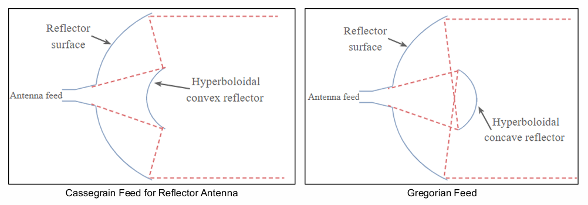

# 现代无线通信
## 1. 天线与传播
### 1.1 天线基础
天线 (Antenna)：将电信号转换为电磁波（发射）或反之（接受）的过渡器件 (An antenna is a device that converts electrical signals into radio waves (for transmission) and vice versa (for reception).)

传输线 (Transmission line)：连接射频源与天线的专用电缆或波导 (A specialized cable or waveguide that connects the radio transmitter or receiver to the antenna)
- 同轴电缆
- 平行线
- 波导
### 1.2 天线参数
天线辐射图：
- 主瓣 (Major lobe)：辐射最强的方向
- 旁瓣 (Side lobe)：非主方向的辐射
- 波束宽度 (Beamwidth)：HPBW & FNBW

场区划分：
- 反应近场区 (Reactive near-field)：紧邻天线，电磁场以储能为主，适用于NFC、RFID等 (Area closest to the antenna, where the electromagnetic fields are highly reactive and non-radiating)

$$R < 0.63\sqrt{\frac{D^3}{\lambda}}$$

- 辐射近场区 (Rediating near-field)：又称菲涅尔 (Fresnel) 区，辐射开始形成 (The region 
between the reactive near-field region and the far-field region; The Radiation starts to form in this region)

$$0.63\sqrt{\frac{D^3}{\lambda}} < R < \frac{2D^2}{\lambda}$$

- 远场区 (Far-field)：又称夫琅禾费 (Fraunhofer) 区，辐射完全形成，用于大多数通信系统 (The area furthest from the antenna where electromagnetic fields are radiated)

$$\frac{2D^2}{\lambda} < R$$

方向性 (Directivity, $D$)：远场参数，描述天线收束能量的能力 (A far field parameter which describes the ability of antenna to focus energy to (a particular) direction(s))
- 各向同性天线 (Isotropic antenna)：理想均匀辐射模型（球形，基本模型）(Antenna which radiates equal amount of energy in all directions)
- 全向天线 (Omnidirectional antenna)：水平面均匀辐射（面包圈型）(Radiates energy equally in all direction of horizontal plane but very limited radiation in vertical plane)
- 定向天线：将能量聚集到特定方向，方向性越大，波束越窄

增益 (Gain, $G$)：考虑天线效益后，相对于各向同性天线的定向辐射能力 (A measure of how well an antenna can focus energy to a particular direction compared to an isotropic antenna)

$$G=e_{\text{tot}}\cdot D$$

$e_{\text{tot}}$ 为总效率
- 单位：dBi（相对于各向同性天线）、dBd（相对于偶极子）
- 同一天线，波束越窄，增益越大

阻抗 (Impedance, $Z$)：天线输入端的电流与电压之比 (The relationship between the voltage and current at the feed point of the antenna)

$$Z=R+jX$$

$R$：电阻部分，消耗或辐射能量; $X$：电抗部分，储存能量
- 阻抗匹配 (Impedance matched)：天线阻抗应与传输线阻抗匹配（通常为$50\Omega$），以实现最大功率传输

反射系数 (Reflection coefficient, $\Gamma$)：反映阻抗失配产生的能量反射 (The ratio of reflected voltage to incident voltage, measuring the reflection or energy loss)

$$\Gamma=\frac{Z_L-Z_0}{Z_L+Z_0}$$

回波损耗 (Return loss)：反射系数的对数形式（通常要求其大于10dB）($\Gamma$ experssed in dB)

$$\text{RL}=-20\log_{10}(\left|\Gamma\right|)$$

反射的功率：
 
$$P_{r}=10^{-\frac{\text{RL}}{10}}$$

### 1.3 天线类型与设计
天线类型：鞭状/单极子、偶极子、八木、环、喇叭、反射阵列、微带贴片、反射面（碟形）、MIMO、相控阵等

半波偶极天线 (Half-wave dipole antenna)：
- 总长度: $L=\dfrac{\lambda}2$
- 馈电阻抗 (Feed-point impedance): $\approx73\Omega$（自由空间）
- 实际长度要 $\times0.97$ 补偿末端效应

微带贴片天线 (Microstrip antenna)：
- 结构：
  - 辐射贴片 (Patch)：The part of the antenna that radiates electromagnetic waves. It is usually made of a conducting material such as copper or gold and can have different shapes 
  - 介质基板 (Substrate)：The patch is placed on a dielectric material. The dielectric constant of the substrate influences the performance of the antenna
  - 接地板 (Ground plane)：A conductive ground plane is located on the opposite side of the dielectric substrate. It helps to reflect the energy radiated by the patch to improve radiation efficiency
  - 微带馈线 (Microstrip feed line)：The microstrip feed line is used to deliver energy from the signal source to the radiating patch of the antenna. Also used for impedance matching
- 设计步骤：

1. 已知：
     - 谐振频率 (Resonant Frequency): $f_r$
     - 介质介电常数 (Dielectric Constant of the Substrate): $\varepsilon_r$
     - 基板高度 (Height of the Substrate): $h$
2. 贴片宽度 $W$：
   
$$W=\frac{c}{2f_r}\sqrt{\frac{2}{\varepsilon_r+1}}$$

3. 有效介电常数 $\varepsilon_{reff}$：

$$\varepsilon_{reff}=\frac{\varepsilon_r+1}2+\frac{\varepsilon_r-1}2\sqrt{1+12\frac{h}{W}}$$

4. 长度延伸量 $\Delta L$：

$$\Delta L=0.412h\frac{\left(\varepsilon_{reff}+0.3\right)\left(\dfrac{W}{h}+0.264\right)}{\left(\varepsilon_{reff}-0.258\right)\left(\dfrac{W}{h}+0.8\right)}$$

5. 实际长度 $L$：

$$L=\frac{c}{2f_r\sqrt{\varepsilon_{reff}}}-2\Delta L$$
  
6. 根据 $Z_0=50\Omega$ 计算馈带宽度 $W_f$ ($t$是贴片厚度)：
   
$$W_f=\frac{7.48\times h}{e^{Z_0\frac{\sqrt{\varepsilon_r+1.41}}{87}}}-1.25\times t$$

7. 确定接地板尺寸

$$L_g=L+6h,\quad W_h=W+6h$$

- 特点：
  - 贴片形式多种多样
  - 低剖面，易制造，成本低
  - 端射 (Broadside) 辐射模式 (Microstrip antennas typically exhibit broadside radiation, meaning they radiate perpendicular to the surface of the antenna)
### 1.3 弗里斯传播方程 (Friss Transmission Equation)
描述自由空间中发射与接收功率的关系：

$$P_r=P_tG_tG_r\left(\frac{\lambda}{4\pi d}\right)^2$$

对数形式：

$$P_r(\text{dB})=P_t(\text{dB})+G_r(\text{dB})+G_t(\text{dB})-20\log_{10}\left(\frac{4\pi d}{\lambda}\right)$$

假设条件：自由空间，无阻挡
### 1.4 卫星通信天线
空间段：卫星本身及星载天线
地面段：地面站发射/接收天线
地面段天线类型：
- 抛物面反射天线：高增益、窄波束 (Uses a curved surface with the cross-sectional shape of a parabola, to direct radio waves. It has very high directivity and gain, producing the narrowest beamwidths for point-to-point communications)
- 馈电方式：卡塞格伦 (Cassegrain)、格雷戈里 (Gregorian)、前馈 (Front feed)、偏馈 (Offset feed)等

星载天线类型：
- 反射面天线 (Reflector)、喇叭天线 (Horn)、相控阵天线 (Phased array)、反射阵列天线 (Reflectarray)、贴片天线 (Patch) 等
### 1.5 5G
第五代通信技术 (5G)：The fifth generation of wireless cellular technology and is the new global wireless standard after 4G/LTE.

关键技术：
- 增强移动宽带 (Enhance Mobile Broadband, eMBB)：Provides significantly faster data speeds and larger data volumes for mobile communications
- 大规模机器通信 (Massive Machine Type Communication, mMTC)：Supports the connectivity of a vast number of devices, particularly in massive IoT applications
- 超可靠低时延通信 (Ultra-Reliable and Low Latency Communication, URLLC)：Designed for applications that require extremely low latency and high reliability, such as autonomous vehicle, remote real-time surgeries, etc

频谱：
- 低频段 (<1 GHz)：覆盖广
- 中频段 (1~6 GHz)：平衡覆盖与容量
- 高频段 (>24 GHz)：高速短距

先进天线系统 (Advanced Antenna System, AAS)：使用多天线技术包括波束成形和MIMO技术 (An active antenna system, where the active transceiver array and the passive antenna array are intelligently integrated into a single hardware unit)

### 1.6 MIMO
天线配置类型：
- 单输入单输出，SISO
- 单输入多输出，SIMO
- 多输入单输出，MISO
- 多输入多输出，MIMO

MIMO使用多天线同时传输数据流，在不需要额外带宽或更高功率的前提下提高吞吐量

MIMO信道模型：
- 接受信号向量（数学模型）: $\boldsymbol{Y}=\boldsymbol{HX}+\boldsymbol{W}$ ($\boldsymbol{X}\to\boldsymbol{Y}$)
- $\boldsymbol{H}$为信道矩阵, $\boldsymbol{W}$为噪声矩阵

空间分集 (Spatial diversity)：
- 通过多个独立信道发送相同数据，提高可靠性 (Provides diversity gain; Multiple copies of the same data are sent across independently fading channels)
- 分集增益 $=$ 发射天线数 $\times$ 接收天线数 (Diversity gain)
- 理论上最大分集增益与分集路径相等
- $1\to N$中每个N收到的都一样

空间复用 (Spatial multiplexing)：
- 通过多个信道发送独立数据流，提高数据率（复用增益, Multiplexing gain） (Provides multiplexing gain. Each channel carries independent information.)
- $1\to N$中每个N收到的都不一样

大规模MIMO (Massive MIMO)：基站部署大量天线（数十至数百），提升频谱和能量效率 (A type of wireless communications technology in which base stations are equipped with a very large number of antenna elements, utilizing the same time and frequency resource, to improve spectral and energy efficiency)
- 应用技术：
  - 波束成形 (Beamforming)：通过调整天线阵列相位，将波束指向特定用户，增强信号并减少干扰 (Involves the directional transmission and reception of signals between a base station and user equipment; It uses multiple antennas to create narrow beams that can be directed toward specific users or devices, rather than broadcasting signals in all directions)
    - Higher data rates
    - Better coverage
    - More efficient use of the available spectrum
    - Helps a user to receive a strong signal without interference with other users
    - 方法：By pre-compensating the phases of transmit antennas
  - 多址技术 (Multiple access technique)：Enables multiple users to simultaneously share a finite piece of radio spectrum.
    - 老版本通信：
      - 码分多址 (Code division multiple access)
      - 频分多址 (Frequency division multiple access (FDMA))
      - 时分多址 (Time division multiple access)
    - 5G 使用的新技术：
      - 正交频分多址 (Orthogonal FDMA (OFDMA))
      - 单载波频分多址 (Single-carrier FDMA (SC-FDMA))
      - 非正交多址 (Nonorthogonal multiple access)
      - 波分多址 (Beam Division Multiple Access (BDMA))：将波束分配给不同用户，实现多址接入，适用于5G高密度场景 (Works by allocating highly directive orthogonal beams to multiple mobile stations in 5G networks)
  - 波束导向 (Beam Steering)：通过电子相位控制动态改变波束方向，用于跟踪移动目标 (The process of dynamically changing the direction of the main lobe of a beam in an antenna array system)

阵列天线 (Array Antenna)：将特定模式排列的多个单独天线元件作为单个天线系统协同工作的配置 (A configuration of multiple individual antenna elements arranged in a specific pattern to work together as a single antenna system)

相控阵天线 (Phased Array Antenna)：由多个天线单元组成，通过电子控制相位实现波束扫描 (A type of array antenna in which the phase of the signal at each individual antenna element is controlled electronically)
- 阵列增益公式 ($N$为单元数, $G_e$为单元增益, $L$为损耗)：

$$\text{Array Gain}=10\log_{10}(N)+G_e-L_{\text{ohmic}}−L_{\text{scan}}$$

## 2. 大规模MIMO系统
### 2.1 大规模MIMO
优势：
- 容量提升 (Capacity enhancement)：支持更多用户和设备
- 能量效率 (Energy efficiency)：波束赋形减少能量浪费和干扰
- 数据速率提升 (Enhanced data rates)：同时服务多用户
- 链路可靠性 (Link reliability)：多径效应提升信号可靠性

特性：
- 通过波束赋形 (Ceamforming) 和波束导向 (Beam steering) 实现5G承诺的高吞吐量与容量
- 波束更窄，天线远多于用户设备，提升传输精准度
- 使用毫米波频段（>24 GHz），天线小巧易安装

特征：天线数M远大于用户数K
### 2.2 频谱效率
区域吞吐量 (Area Throughput)：
- 区域吞吐量 $=$ 带宽 $\times$ 小区密度 $\times$ 频谱效率
- 单位：bit/(s$\cdot$km$^2$)
- 提升吞吐量：
  - 增加带宽 (Allocate more bandwidth)
  - 增加基站密度 (Densify the network by adding more BSs)
  - 提升每小区频谱效率 (Improve the SE per cell)

双重网络结构 (Two Network Tier)：
- 热点层 (Hotspot tier)：高吞吐量、小范围服务少数用户，适用于毫米波频段
- 覆盖层 (Coverage tier)：广域覆盖、支持移动性，频谱效率是关键挑战
  - 覆盖层是重点研究方向

频谱效率 (Spectral Efficiency)：
- 带宽 (Bandwidth)：
  - 基带信号 (Baseband)：$B/2$
  - 通带信号 (Passband)：$B$
- 奈奎斯特-香农采样定理：带宽为B的信号每秒至少需2B个实样本
- 频谱效率定义：每复样本可可靠传输的比特数，单位bit/(s$\cdot$Hz)

提升频谱效率的途径：
  - 多用户同时传输 (Many simultaneous users)
  - 强定向信号 (Strong directive signals)
  - 低干扰 (Little interference leakage)

不同模型的区别：$q$为样本能量，$q=P/B$
  
||SISO|SIMO|MISO|
|:---:|:---:|:---:|:---:|
|数学模型|$y[l] = g\cdot x[l]+n[l]$|$\boldsymbol{y} = \boldsymbol{g}x+\boldsymbol{n}$|$y=\boldsymbol{g}^T\boldsymbol{x}+n$|
|输入|$x[l]\sim CN(0,q)$|$x[l]\sim CN(0,q)$|$\boldsymbol{x}=\boldsymbol{w}\tilde{x}$, $\tilde{x}\sim CN(0,q)$|
|噪声|$n[l]\sim CN(0,N_0)$|$n_m\sim CN(0,N_0)$|$n\sim CN(0,N_0)$|
|容量公式|$C=\log_2\left(1+\dfrac{q\lvert g\rvert^2}{N_0}\right)$|$C=\log_2\left(1+\dfrac{q\lVert g\rVert^2}{N_0}\right)$|$C=\log_2\left(1+\dfrac{q\lVert g\rVert^2}{N_0}\right)$|

注：$\boldsymbol{g}$为列向量，$\displaystyle\lVert g\rVert^2=\sum_{i=0}^{M}|g_m|^2$

- 点对点MIMO：
  - $K$个发送，$M$个接收
  - 数学模型：$\boldsymbol{y}=\boldsymbol{G}\boldsymbol{x}+\boldsymbol{n}$，$\boldsymbol{G}$为$M\times K$矩阵
  - 通过SVD（奇异值分解），有$\boldsymbol{G}=\boldsymbol{U}\boldsymbol{\Sigma}\boldsymbol{V}^H$，$\boldsymbol{\Sigma}$的对角线值为$s_1,s_2,\cdots,s_{\min{(M,K)}}$
  - 令$\tilde{\boldsymbol{y}}=\boldsymbol{U}^H\boldsymbol{y}$, $\boldsymbol{x}=\boldsymbol{V}^H\tilde{\boldsymbol{x}}$, $\tilde{\boldsymbol{n}}=\boldsymbol{U}^H\boldsymbol{n}$，有：$$\tilde{\boldsymbol{y}}=\boldsymbol{\Sigma}\tilde{\boldsymbol{x}}+\tilde{\boldsymbol{n}}$$
  - 容量：当$q_1,q_2,\cdots,q_S$均最大，且$\displaystyle\sum_{k=1}^{S}q_k=q$ $$C=\sum_{k=1}^{S}\log_2\left(1+s_k^2\frac{q_k}{N_0}\right)$$
  - 可通过注水算法分配功率：$q_k=\max{\left(\mu-\dfrac{N_0}{s_k^2},0\right)}$
- 最优功率分配——注水算法：
  - 功率分配给信道条件好的子信道
  - 低信噪比：只分配给最强子信道。
  - 高信噪比：近似均等分配。
  - 复用增益在高信噪比下显著，低信噪比下主要为波束赋形增益
- MIMO容量对比与问题：
  - MIMO容量随天线数线性增长（理想条件下）
  - 在视距环境中复用增益有限；用户设备天线数量受限；不易扩展。
- 多用户MIMO
  - 分为上行链路 (Uplink) 和下行链路 (Downlink)
  - 与点对点MIMO的区别：用户间不协作 (Users do not cooperate)、各自有功率限制 (Each user cares about its own performance and has its own power budget)、信道建模不同 (The channel matrix $\boldsymbol{G}$ is modeled differently)
  - 大规模MIMO优势：天线数远多于用户数，干扰更小、波束赋形增益更大