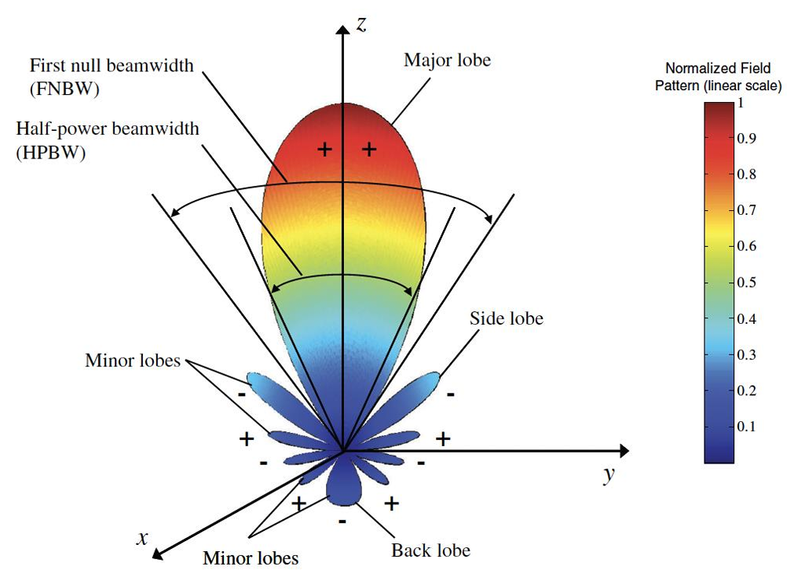

# 现代无线通信
## 1. 天线与传播
### 1.1 天线基础
- 天线 (Antenna)：将电信号转换为电磁波（发射）或反之（接受）的过渡器件 (An antenna is a device that converts electrical signals into radio waves (for transmission) and vice versa (for reception).)
- 传输线 (Transmission line)：连接射频源与天线的专用电缆或波导 (A specialized cable or waveguide that connects the radio transmitter or receiver to the antenna)
  - 同轴电缆
  - 平行线
  - 波导
### 1.2 天线参数
- 天线辐射图：

- 主瓣 (Major lobe)、旁瓣 (Side lobe)、第一零点波束宽度 (FNBW)、半功率波束宽度 (HPBW)
- 场区划分：
  - 反应近场区 (Reactive near-field)：紧邻天线，电磁场以储能为主，适用于NFC、RFID等 $$R<0.63\sqrt{\frac{D^3}{\lambda}}$$
  - 辐射近场区 (Rediating near-field)：又称菲涅尔 (Fresnel) 区，辐射开始形成 $$0.63\sqrt{\frac{D^3}{\lambda}}<R<\frac{2D^2}{\lambda}$$
  - 远场区 (Far-field)：又称夫琅禾费 (Fraunhofer) 区，辐射完全形成，用于大多数通信系统 $$\frac{2D^2}{\lambda}<R$$
- 方向性 (Directivity, $D$)：
  - 各向同性天线 (Isotropic antenna)：理想均匀辐射模型（球形）
  - 全向天线 (Omnidirectional antenna)：水平面均匀辐射（面包圈型）
  - 定向天线：将能量聚集到特定方向，方向性越大，波束越窄
- 增益 (Gain, $G$)：考虑天线效益后，相对于各向同性天线的定向辐射能力
  - 公式：$e_{\text{tot}}$为总效率$$G=e_{\text{tot}}\cdot D$$
  - 单位：dBi（相对于各向同性天线）、dBd（相对于偶极子）
  - 波束越窄、增益越大
- 阻抗 (Impedance)：天线输入端的电流与电压之比
  - 公式：$$Z=R+jX$$
    - R：电阻部分，消耗或辐射能量
    - X：电抗部分，储存能量
  - 阻抗匹配 (Impedance matched)：天线阻抗应与传输线阻抗匹配（通常为$50\Omega$），以实现最大功率传输
- 反射系数 (Reflection coefficient)：反映阻抗失配产生的能量反射
  - 公式：$$\Gamma=\frac{Z_L-Z_0}{Z_L+Z_0}$$
- 回波损耗 (Return loss)：反射系数的对数形式（通常要求其大于10dB）
  - 公式：$$RL=-20\log_{10}(\left|\Gamma\right|)$$
  - 反射的功率：$$P_{r}=10^{-\frac{RL}{10}}$$
### 1.2 天线类型与设计
- 天线类型：鞭状/单极子、偶极子、八木、环、喇叭、反射阵列、微带贴片、反射面（碟形）、MIMO、相控阵等
- 半波偶极天线 (Half-wave dipole antenna)：
  - 总长度：$$L=\frac{\lambda}2$$
  - 馈电阻抗 (Feed-point impedance)：约$73\Omega$（自由空间）
- 微带贴片天线 (Microstrip antenna)：
  - 结构：辐射贴片 (Patch) +介质基板 (Substrate) +接地板 (Ground plane) +微带馈线 (Microstrip feed line)
  - 设计步骤：
    1. 已知：谐振频率$f_r$，介质介电常数$\varepsilon_r$，基板高度$h$
    2. 贴片宽度$W$：$$W=\frac{c}{2f_r}\sqrt{\frac{2}{\varepsilon_r+1}}$$
    3. 有效介电常数$\varepsilon_{reff}$：$$\varepsilon_{reff}=\frac{\varepsilon_r+1}2+\frac{\varepsilon_r-1}2\sqrt{1+12\frac{h}{W}}$$
    4. 长度延伸量$\Delta L$：$$\Delta L=0.412h\frac{\left(\varepsilon_{reff}+0.3\right)\left(\dfrac{W}{h}+0.264\right)}{\left(\varepsilon_{reff}-0.258\right)\left(\dfrac{W}{h}+0.8\right)}$$
    5. 实际长度$L$：$$L=\frac{c}{2f_r\sqrt{\varepsilon_{reff}}}-2\Delta L$$
    6. 根据$Z_0=50\Omega$计算馈带宽度$W_f$（$t$是贴片厚度）：$$W_f=\frac{7.48\times h}{e^{Z_0\frac{\sqrt{\varepsilon_r+1.41}}{87}}}-1.25\times t$$
    7. 确定接地板尺寸$$L_g=L+6h$$$$W_h=W+6h$$